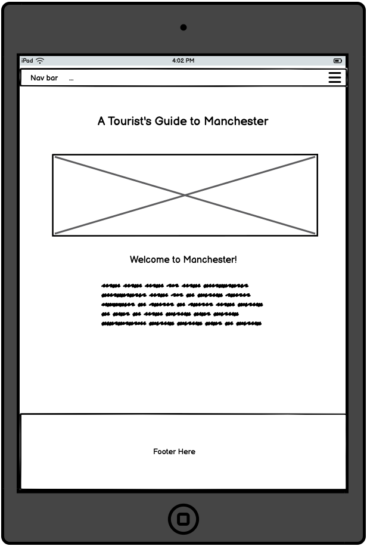
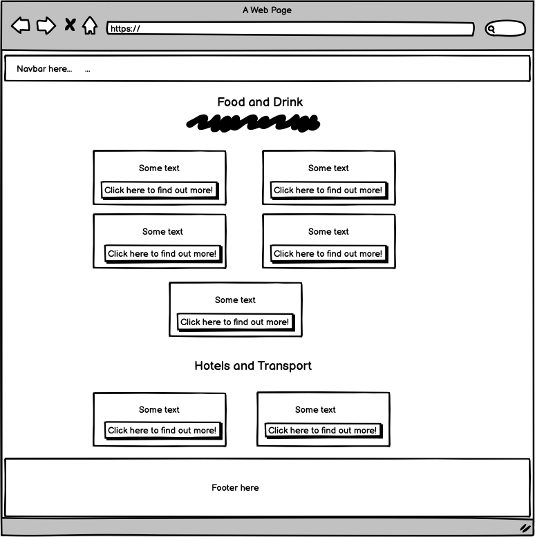
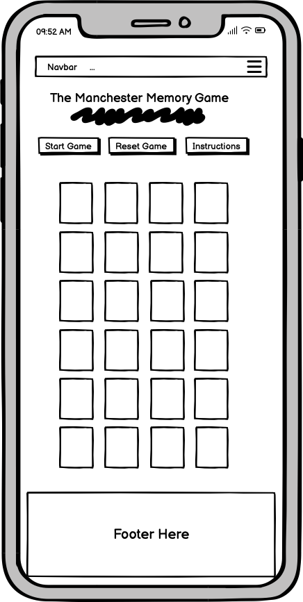

# Manchester Tourist Website

This website is a tourist guide for tourists visiting Manchester. 

The website contains five pages. Here is the list of the pages below:
 * Home page
 * Attractions page
 * Food and drink, hotels and transport page
 * A Manchester themed memory game (for a bit of fun!)
 * Contact page

Please see the live link below of the project.
https://hannahro15.github.io/Manchester-Tourist-Project/

# UX
## Wireframes

 Below are some wireframes I created for the various pages using a programme called Balsamiq.

Home Page - Mobile
   

Home Page - Tablet
   

Home Page - Laptop
   

Attractions and Things to Do Page - Mobile
  

Attractions and Things to Do Page - Tablet
  
 

Attractions and Things to Do Page - Laptop
   

Food and Drink, Hotels and Transport Page - Mobile
  
 

Food and Drink, Hotels and Transport Page - Tablet
   
 

Food and Drink, Hotels and Transport Page - Laptop
   
 

Memory Game Page - Mobile
   

Memory Game Page - Tablet
   

Memory Game Page - Laptop
   

Contact Page - Mobile
   

Contact Page - Tablet
   

Contact Page - Laptop
  
 

## User Stories

* As a user, it should be clear what the purpose of the website is about and what information it contains.
* As a user, on the attractions and things to do page, when you click on the buttons it should show information on attractions and things to do, with the relevant links.
* As a user, on the food and drinks, hotels and transport page, when you click on the buttons it should show information on eating and drinking out, hotels, and transport, with the relevant links.
* As a user, I expect the memory game to be fully functional so I can enjoy playing the game.
* As a user, on the contact page I expect to be able to fill out and submit the form easily.
* As a user, I expect to be directed to the correct social links which are found in the footer.
* As a user, I expect the website to be response on different screen sizes.
* As a user, I expect everything on the website to behave as expected on different browsers.

## Technologies used

* HTML
* CSS
* Bootstrap 5.3
* Vanilla Javascript

## Features

## Testing

### Bugs
### Fixed bugs 
- Unflipping cards for non matches for more than one pair. 
- Game over message appearing as well as the congratulatory message appearing one after each other at the end of a game.
- Game over/completion game messages appearing at the end of memory game before matching all cards when 2 seconds left in timer. 
### Unfixed Bugs
- Responsiveness issue of memory game not working on larger screens.
- Card-back image for cards on memory game are not aligning centrally in each card-item container.
- 3rd card in a row can still be clicked when trying to match 2 cards that don't work, but it is sort of ok when the unflipping happens after a short length of time for unmatches as setTimeout has a short time.
- Matching pair and non-matching pair messages alerting users when they match or don't match a pair sometimes both show up above the game board.

## Testing

I have run all the html and css pages through the html and css validators and I can confirm there are no errors.

## Credits

### General

* [Canva](https://www.canva.com/) - or creating and designing the logo

* [Balsamiq](https://balsamiq.com/wireframes/) - for creating the wireframes

* [Gitpod](https://www.gitpod.io/) - For working/completing on my project

* [Github](https://github.com/) - To store my project online

* [Bootstrap](https://getbootstrap.com/docs/5.3/getting-started/introduction/) - For the relevant documentation

* [W3 schools](https://www.w3schools.com/) - For general documentation

* [Rgb color code website](https://rgbcolorcode.com/) - For choosing colours

* [Readme Markdown](https://github.com/adam-p/markdown-here/wiki/Markdown-Cheatsheet#links) - For markdown documentation for the ReadMe

* [ChatGPT](https://openai.com/index/chatgpt/) - For general debugging and re-factoring of code, as well as using Google Chrome dev tools.

### Images

* [Icons-8](https://icons8.com/) - For the icons used in the memory game

* [Pixabay - home page image](https://pixabay.com/photos/buildings-tram-rails-skyscrapers-7759041/) - Home page Image from Pixabay

* [Pexels - back of memory cards image](https://www.pexels.com/photo/photo-of-building-in-chetham-manchester-11856438/) - The back of the card images on the memory game from Pexels

* [Font Awesome](https://fontawesome.com/icons) - For the icons used for the social links in the footer

### Content/Documentation

* [W3schools - flipping cards on memory game](https://www.w3schools.com/howto/howto_css_flip_card.asp) - For general structure and initial flipping of cards and modified and customised

* [Martina Ferreira tutorial of memory game](https://www.freecodecamp.org/news/vanilla-javascript-tutorial-build-a-memory-game-in-30-minutes-e542c4447eae/) - For the general idea of how the memory game works, and in particular used the shuffling function from here and modified and customised it for my own game

* All content about Manchester on the website was written myself from my knowledge of living in Manchester for many years.

### Testing

* [HTML validator](https://validator.w3.org/) - For validating my HTML code

* [CSS validator](https://jigsaw.w3.org/css-validator/) - For validating my CSS code

* [JS Hint](https://jshint.com/) - For validating my Javascript code

* [Page speed Insights/Lighthouse](https://pagespeed.web.dev/) - For testing performance, accessibility, best practices and SEO on all pages I used a website called Page Speed Insights

* [Am I responsive](https://ui.dev/amiresponsive) - For testing responsiveness and also for taking screenshots of the different pages on the website.

## Deployment

To fork/clone the project to your own computer: 

* Fork the repository - https://github.com/hannahro15/Manchester-Tourist-Project

* Click on the green code button.

* Copy the url link.

* Type git clone followed by the repository url link shown above in your terminal to add/clone it to your computer.

Steps to deploy the website locally to GitHub Pages:

* Go to settings in your repository.

* On the side bar click on 'pages'.

* Click on 'deploy from branch' under the source tab.

* Under the branch tab below, select main branch (could be master instead), and to the right of it select where it says /root.

* To the right of where the main/master branch were selected and '/root', and then click save.

* The website is now deployed and this is the link to the deployed site which should be found in your repository - https://hannahro15.github.io/Manchester-Tourist-Project/

