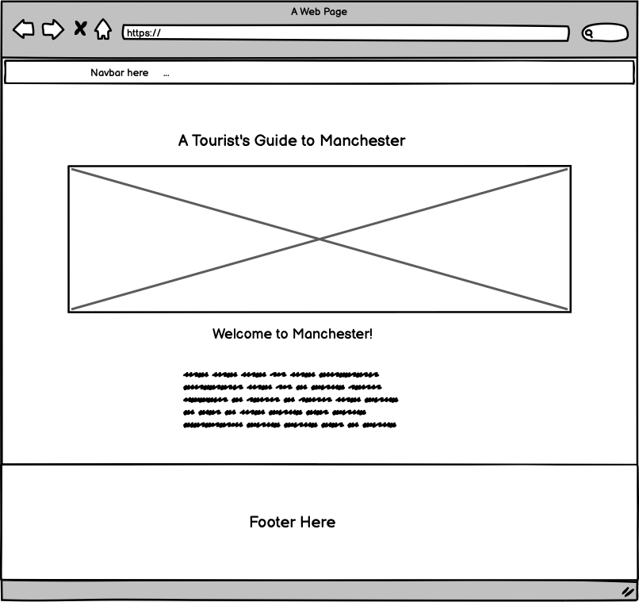

# Manchester Tourist Website

# UX
## Wireframes

 Below are some wireframes I created for the various pages using a programme called Balsamiq.

Home Page - Mobile
   

Home Page - Tablet
   

Home Page - Laptop
   

Attractions and Things to Do Page - Mobile
  

Attractions and Things to Do Page - Tablet
   

Attractions and Things to Do Page - Latop
   

 Food and Drink, Hotels and Transport Page - Mobile
   

 Food and Drink, Hotels and Transport Page - Tablet
   

 Food and Drink, Hotels and Transport Page - Laptop
   

Contact Page - Mobile
   

Contact Page - Tablet
   

Contact Page - Laptop
  
 

