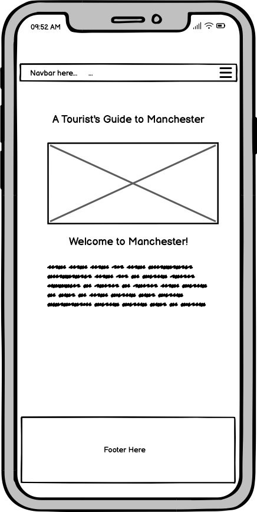
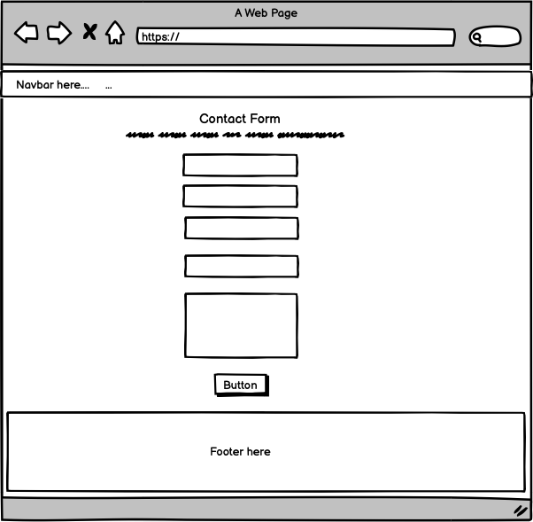
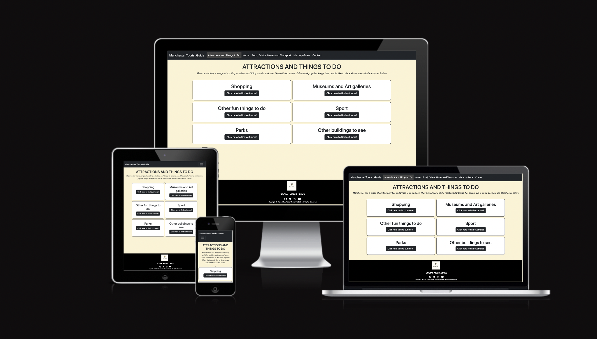
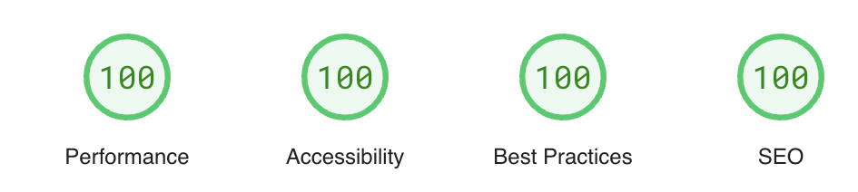

# Manchester Tourist Website

This website is a tourist guide for tourists visiting Manchester. 

The website contains five pages. Here is the list of the pages below:
 * Home page
 * Attractions page
 * Food and drink, hotels and transport page
 * A Manchester themed memory game (for a bit of fun!)
 * Contact page

Please see the live link below of the project.
https://hannahro15.github.io/Manchester-Tourist-Project/

# UX
## Wireframes

 Below are some wireframes I created for the various pages using a programme called Balsamiq.

Home Page - Mobile
   

Home Page - Tablet
   

Home Page - Laptop
   

Attractions and Things to Do Page - Mobile
  

Attractions and Things to Do Page - Tablet
  
 

Attractions and Things to Do Page - Laptop
   

Food and Drink, Hotels and Transport Page - Mobile
  
 

Food and Drink, Hotels and Transport Page - Tablet
   
 

Food and Drink, Hotels and Transport Page - Laptop
   
 

Memory Game Page - Mobile
   

Memory Game Page - Tablet
   

Memory Game Page - Laptop
   

Contact Page - Mobile
   

Contact Page - Tablet
   

Contact Page - Laptop
  
 

## User Stories

* As a user, it should be clear what the purpose of the website is about and what information it contains.
* As a user, on the attractions and things to do page, when you click on the buttons it should show information on attractions and things to do, with the relevant links to the places.
* As a user, on the food and drinks, hotels and transport page, when you click on the buttons it should show information on eating and drinking out, hotels, and transport, with the relevant links to the places.
* As a user, I expect the memory game to be fully functional so I can enjoy playing the game.
* As a user, on the contact page I expect to be able to fill out and submit the form easily and for it to take me to the Code Institute Dump Form Processor page on another tab.
* As a user, I expect to be directed to the correct social links on another page which are found in the footer.
* As a user, I expect the website to be responsive on different screen sizes.
* As a user, I expect everything on the website to behave as expected on different browsers.

## Technologies used

* HTML
* CSS
* Bootstrap 5.3
* Vanilla Javascript

## Fonts and Colors

For the fonts across the website I used a basic sans-serif font. In some of the containers and across the website I used an italic style text to ensure the text looked more visually appealing. 

Regarding the color schemes, I chose to the colours of yellow, white, various shades of grey, and black. I wanted the colours across the website to reflect the colours of a bee which is the symbol of Manchester. I also didn't want the yellow to be too bright or too dark so everything was easily visible and the website could be more attractive.

## Features

## Navigation Bar

The navigation bar is a responsive navigation menu using Bootstrap. On smaller screens I used a hamburger menu for the various pages and for larger screens the links of the pages are listed at the top.

### Home Page

The home page is a page introducing people to the what the website is about.

### Attractions and Things to Do Page

This page is gives a lot of the main attractions and things to do around Manchester. The item with the links to the places are listed in a dropdown within various boxes/containers for different categories.

### Food and Drink, Hotels and Transport Page

The food, hotels, transport page consists of information about where to eat out, various bars, and also about where to stay such as hotels. it also gives an overview to the transport around Manchester.

### The Manchester Memory Game

The main feature that uses Javascript in this website is a Manchester themed memory game. It consists of 24 pairs (12 separate icons) that reflect things to do with Manchester. There is timer of 120 seconds(2 minutes) whilst playing the game and has little messages each time you match a pair or don't match a pair. Also when the timer runs out a message pops up when you complete or don't complete the game.

### Contact Page

This page consists of a form that user fill out if they want to enquire about things in Manchester. As it has basic form validation, and also when you click the submit button it takes you on another page to the Code Institute Form Dump Processor page.

This is the page for if there is an unknown url that it is directed to. It is kept very simple and has a link that users can click on to go back to the home page.

## Testing

### Bugs

#### Fixed bugs 
- Unflipping cards for non matches for more than one pair. 
- Game over message appearing as well as the congratulatory message appearing one after each other at the end of a game.
- Game over/completion game messages appearing at the end of memory game before matching all cards when 2 seconds left in timer. 
- Matching pair and non-matching pair messages alerting users when they match or don't match a pair sometimes both show up above the game board.
-  Double-clicking on first click for the buttons on the attractions page, and the food-hotels-transport page too. This was fixed by removing the if statement with the display none and block, and changing it to a classlist with the toggle function. 
- Card-back image for cards on memory game are not aligning centrally in each card-item container.

#### Unfixed Bugs
- Responsiveness issue of memory game not working as expected on larger screens as it doesn't show as a proper square/rectangle.
- 3rd card in a row can still be clicked when trying to match 2 cards that don't work. It is not a huge issue as the timings of the card flipping and unflipping seem to be work okay because of the the timings of 'setTimeout'.
- Containers on attraction page, and the food-hotels-transport page, show blank space on a neighbouring container when opening up the current container. Could be an issue with some elements within the grid maybe.
- Some images with low resolution across the website. I changed the image on the home page and it still has low resolution.

### HTML/CSS/JS Validators

I have run all the html and css pages through the html and css validators and I can confirm there are no errors. I have also done passed my code through the JS validator (JS Hint), and all the main errors have been sorted out, which were mainly to do with semi-colons.

### Difference between Manual Testing and Automated Testing

#### Manual Testing
Manual testing is used to check responsiveness on the website and browsers, and to check that everything functions as expected on the website.  It can also be used for behavior-driven development which is checking everything works as you are working through the project bit by bit, which is the approach that I used on this project. Manual testing is also used for checking that the points made in the user stories are implemented and for checking the overall functionality of the website. Also it is for checking that the whole website/application looks and works the way you expect and for testing the user experience (such as if links and buttons work) on the website/application itself, rather than testing behind the scenes in the actual code itself.

#### Automated Testing
Automated testing can be used by various testing frameworks such as Jest, Selenium, Jasmine, or Cypress. There are other teesting frameworks out there too but lesser known. Automated testing can be used to check Javascript functions and to check code is working as expected. The way automated testing works is that you write a piece of test code and you expect it to fail, then you write a small bit of the code in the function itself to make the test pass, and then re-factor the code if necessary. This system is used a lot for automated testing and it is known as red-green-refactor. This process repeats for each test that you write. This process ensures that bugs are caught and prevented as you are developing and testing your application.

### Manual Testing

#### Lighthouse Testing
I have been using Lighthouse/Page Speed Insights to test my web pages. Please see the final screenshots for the testing on all the pages. I have been correcting any small issues as they arose.

#### Home Page/index.html - Mobile

#### Home Page/index.html - Desktop

#### Attractions Page - Mobile

#### Attractions Page - Desktop

#### Food, Hotels, and Transport Page - Mobile

#### Food, Hotels, and Transport Page - Desktop

#### Memory Game Page - Mobile

#### Memory Game Page - Desktop

#### Contact Page - Mobile

#### Contact Page - Desktop

#### 404 Page - Mobile

#### 404 Page - Desktop

#### Testing User Stories

| User Story | Does this behave as expected? |
| --- | --- |
| As a user, it should be clear what the purpose of the website is about and what information it contains. | Yes |
| As a user, on the attractions and things to do page, when you click on the buttons it should show information on attractions and things to do, with the relevant links to the places. | Yes |
| As a user, on the food and drinks, hotels and transport page, when you click on the buttons it should show information on eating and drinking out, hotels, and transport, with the relevant links to the places | Yes |
 As a user, I expect the memory game to be fully functional so I can enjoy playing the game. | Yes |
| As a user, on the contact page I expect to be able to fill out and submit the form easily and for it to take me to the Code Institute Dump Form Processor page on another tab. | Yes |
| As a user, I expect to be directed to the correct social links on another page which are found in the footer. | Yes |
| As a user, I expect the website to be responsive on different screen sizes. | Yes |
| As a user, I expect everything on the website to behave as expected on different browsers. | |

#### Browser Testing

| Browser | Everything behaves as expected? |
| --- | --- |
| Google Chrome | |
| Safari | |

## Future Features
 - For the memory game, add in three difficulty levels with countdown timers of varying lengths.
 - For the memory game, add in options for different sizes of game boards.
 - For the memory game, implement a scoring system place, and maybe with a leaderboard in.
 - Add in a map of Manchester with or without markers somewhere on the website.
 - Improve the form by making validation more specific such as in Javascipt rather than in Bootstrap, like maybe having certain length passwords, regex for email addresses etc.
 - Add in an animation of a bee that moves across one or more pages of the website. 
 
## Credits

### General

* [Canva](https://www.canva.com/) - or creating and designing the logo

* [Balsamiq](https://balsamiq.com/wireframes/) - for creating the wireframes

* [Gitpod](https://www.gitpod.io/) - For working/completing on my project

* [Github](https://github.com/) - To store my project online

* [Bootstrap](https://getbootstrap.com/docs/5.3/getting-started/introduction/) - For the relevant documentation

* [W3 schools](https://www.w3schools.com/) - For general documentation

* [Rgb color code website](https://rgbcolorcode.com/) - For choosing colours

* [Readme Markdown](https://github.com/adam-p/markdown-here/wiki/Markdown-Cheatsheet#links) - For markdown documentation for the ReadMe

* [ChatGPT](https://openai.com/index/chatgpt/) - For general debugging, finding errors, and re-factoring of code. I used Google Chrome Dev tools as well for debugging.

### Images

* [Icons-8](https://icons8.com/) - For the icons used in the memory game

* [Unsplash - home page image](https://unsplash.com/photos/people-walking-on-sidewalk-near-brown-concrete-building-during-daytime-kQ7u8Kgkzlo) - Home page Image from Unplash

* [Pexels - back of memory cards image](https://www.pexels.com/photo/photo-of-building-in-chetham-manchester-11856438/) - The back of the card images on the memory game from Pexels

* [Font Awesome](https://fontawesome.com/icons) - For the icons used for the social links in the footer

* [Tiny PNG](https://tinypng.com/) - For compressing images.

* [Free Convert](https://www.freeconvert.com/webp-converter) - For converting images to webp.

### Content/Documentation

* [W3schools - flipping cards on memory game](https://www.w3schools.com/howto/howto_css_flip_card.asp) - For general structure and initial flipping of cards and modified and customised

* [Martina Ferreira tutorial of memory game](https://www.freecodecamp.org/news/vanilla-javascript-tutorial-build-a-memory-game-in-30-minutes-e542c4447eae/) - For the general idea of how the memory game works, and in particular used the shuffling function from here and modified and customised it for my own game.

* [Game Timer](https://stackoverflow.com/questions/31559469/how-to-create-a-simple-javascript-timer) - For implementing the game timer with the countdown. This was customized for my project.

* For sorting out the whitespace under the footer issue I used some of the code on [this webpage](https://www.30secondsofcode.org/css/s/footer-at-the-bottom/). The website is called the 30 seconds of code website and the page is about the footer being on the bottom.

* All content about Manchester on the website was written myself from my knowledge of living in Manchester for many years.

### Testing

* [HTML validator](https://validator.w3.org/) - For validating my HTML code

* [CSS validator](https://jigsaw.w3.org/css-validator/) - For validating my CSS code

* [JS Hint](https://jshint.com/) - For validating my Javascript code

* [Page speed Insights/Lighthouse](https://pagespeed.web.dev/) - For testing performance, accessibility, best practices and SEO on all pages I used a website called Page Speed Insights

* [Am I responsive](https://ui.dev/amiresponsive) - For testing responsiveness and also for taking screenshots of the different pages on the website.

## Deployment

To fork/clone the project to your own computer: 

* Fork the repository - https://github.com/hannahro15/Manchester-Tourist-Project

* Click on the green code button.

* Copy the url link.

* Type git clone followed by the repository url link shown above in your terminal to add/clone it to your computer.

Steps to deploy the website locally to GitHub Pages:

* Go to settings in your repository.

* On the side bar click on 'pages'.

* Click on 'deploy from branch' under the source tab.

* Under the branch tab below, select main branch (could be master instead), and to the right of it select where it says /root.

* To the right of where the main/master branch were selected and '/root', and then click save.

* The website is now deployed and this is the link to the deployed site which should be found in your repository - https://hannahro15.github.io/Manchester-Tourist-Project/

